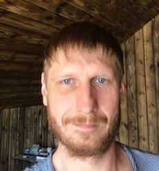

# Alexander Rusakevich

___

## Contact:
>**tel:** 8-909-219-98-02
**e-mail:** multi5@rambler.ru
**telegram:** @AlexRKV
**github** : [@AlexRKV](https://github.com/AlexRKV)

___

## About me...

> I am 37 years old. My goal at this stage of my life is programming! I will do my best to realize myself in this area.
> I started learning programming on my own. The volume of information is large, it was difficult to select the necessary information from all this flow, but gradually, in my head, I began to put everything on the shelves and you understand that everything is still ahead. And I really like it :)

> **Basic knowledge:** JS, html, css, scss, git, jest, node, figma, bem.
>**Knowledge of English**: A2 

___

## The script

    function findUniq(arr) {
        return +arr.filter((el, _, arr) => arr.indexOf(el) === arr.lastIndexOf(el)).join('')
    }
    
___

## Education

**2001 - 2007**
>Belgorod University of Consumer Cooperation

___

## Work Experience

> **2014 - 2022**
Department of Capital Construction of the Lipetsk Region
**position: chief mechanic.**

> **2011 - 2014**
Fast food chain "Buffet"
**position: Deputy director**

> **2008 - 2013**
Trade in
**positon: Sales manager**

>**2001-2002** 
Air Communications Agency
**position**: Electronics engineer
